Swarm: The Tutorial
===================

This is a brief tutorial that should hopefully get you up and running
with Swarm.  Swarm is changing rapidly, so this tutorial may not be
entirely up-to-date in some unimportant ways (*e.g.* the UI may look
slightly different), but the intention is to keep it updated as the
game evolves.  If you find any mistakes, or things that are confusing,
or ways that the tutorial no longer corresponds to the game, please
[file a bug
report](https://github.com/byorgey/swarm/issues/new/choose) or [open a
pull
request](https://github.com/byorgey/swarm/blob/main/CONTRIBUTING.md)!
Eventually, this tutorial file should be [replaced by an in-game
tutorial](https://github.com/byorgey/swarm/issues/25).

It is recommended that you use a relatively large terminal window
(*e.g.* 132 x 43 at a minimum, ideally larger).  On the other hand,
the larger the window, the longer it takes the `vty` library to draw a
frame.  You can play with the sizing while the game is running---it
will automatically adjust to the size of the terminal.

The backstory
-------------

In a shockingly original turn of events, you have crash landed on an
alien planet!  ~~Your only hope is to~~ Scratch that, you have no hope
at the moment, but since you're here, you might as well explore a bit.
Your sensors indicate that the atmosphere is highly toxic, so you'll
have to stay inside your robotic base, with its built-in life support
system.  However, you are stocked with all the materials you need to
build a lot of robots to explore for you!  To start, you only have the
materials to make some very basic devices which give your robots
abilities like moving, turning, grabbing things, and interpreting
very simple imperative programs.  As you use your robots to gather
resources, you will be able to construct better devices which in turn
allow you to construct robots with upgraded abilities and programming
language features, which in turn allow you to program more
sophisticated robots which in turn will OK I think you get the idea.

Getting started
---------------

When you first start up Swarm, you should be greeted by a screen that
looks something like this:

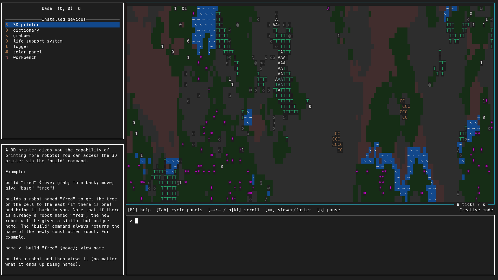

In the world view, you see the default [*World 0*](./TUTORIAL.md#world-generation)
and the little white `Ω` in the middle represents your base. Start by
using the Tab key to cycle through the four panels (the REPL, the
info panel, the inventory panel, and the world panel), and read about the various devices
installed on your base.  There is a lot to take in at first so feel
free to just skim; this tutorial will cover the use of your devices in
more detail.

Building your first robot
-------------------------

Pretty much the only thing you can do is build robots.  Let's build
one!  Tab back to the REPL (or hit the `Meta-r` shortcut) and type
```
build "hello" {move; move; move; move}
```
then hit Enter.  You should see a robot appear and travel to the
east four steps before stopping.  It should look something like this:

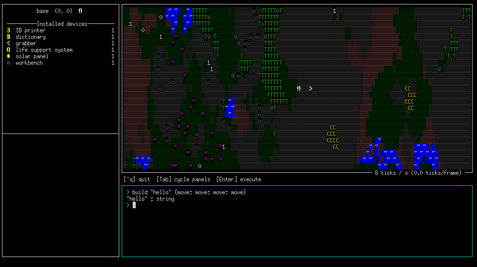

You can also see that on the next line after your input, the REPL printed out
```
"hello" : string
```
which is the result of your command, along with its type.  The `build` command
always returns a string which is the name of the robot that was built;
it may be different than the name you specified if there is already
another robot with that name.

Note that if you don't want a robot to hang around after completing
its job, you can add the `selfdestruct` command to the end of its
program.  Try building a robot that moves a few steps and then
self-destructs.

You can see that a semicolon is used to chain together commands, that
is, if `c1` and `c2` are both commands, then `c1 ; c2` is the command
which executes first `c1` and then `c2`.  The curly braces around the
second argument to `build` are required; curly braces create an
expression whose evaluation is *delayed* until later.  In this case,
the `build` command requires a delayed expression to ensure that the
program will be evaluated *by the newly built robot* and not
immediately when the `build` command itself is being evaluated.

Types
-----

Ultimately, the `build` command is not special syntax, but just a
function that takes two arguments: a string, and a delayed command. We
can actually see the type of the `build` command (or any command) by
just typing it at the prompt, without hitting `Enter`.  Any time the
expression currently typed at the prompt parses and type checks, the
REPL will show you the type of the expression in the upper right, like
this:

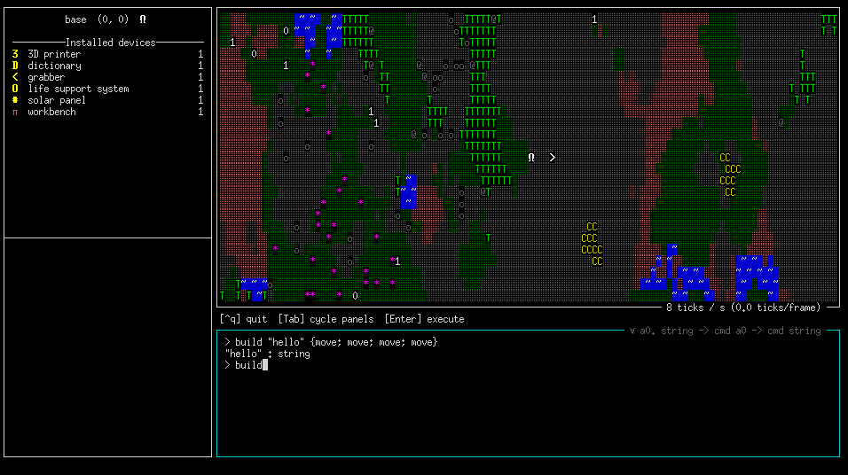

It will tell you that the type of `build` is
```
∀ a0. string -> {cmd a0} -> cmd string
```
which says that `build` takes two arguments---a `string`, and a
delayed command that returns a value of any type---and results in a command
which returns a `string`.  Every command returns a value, though some
might return a value of the unit type, written `()`.  For example, if
you type `move` at the prompt, you will see that its type is `cmd ()`,
since `move` does not return any interesting result after executing.

Let's try intentionally entering something that does not
typecheck. Type the following at the prompt:
```
"hi" + 2
```
Clearly this is nonsense, and you can see that your input is shown in
red, and there is no type displayed in the upper-right corner of the
REPL panel, telling us that there is some kind of error (either a
parse error or a type error).  If you want to see what the error is,
just hit `Enter`: a dialog box will pop up with a (somewhat) more
informative error message.

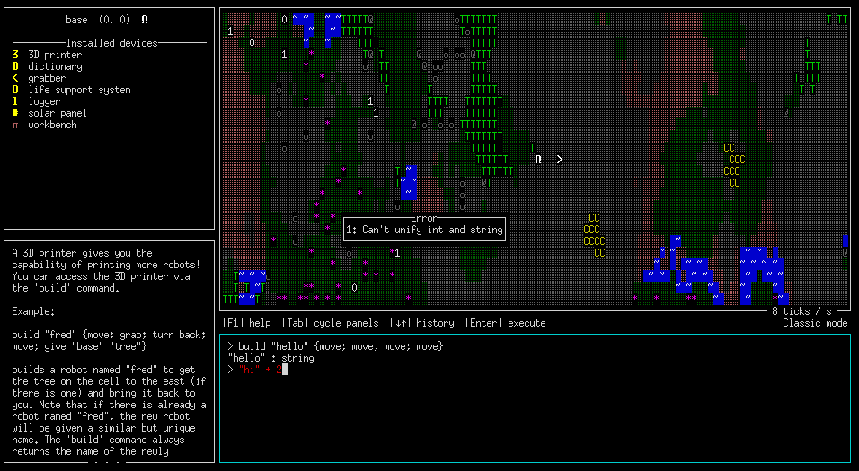

To get rid of the error dialog, just hit the `Esc` key.

Something you can't do yet
--------------------------

Try entering the following at the REPL:
```
build "nope" {make "curry"}
```
The info panel should automatically switch to showing your `logger`
device, with an error message at the bottom saying something like
```
build: this would require installing devices you don't have:
  workbench
```
This is telling you that in order to `build` a robot which has the right
capabilities to run this program, you would need to
install a `workbench` device on the robot, but you don't have a
`workbench` in your inventory.  (You do have a `workbench` device
*installed* in your base robot, but you can't rip it out and put it in
another robot.  You'll have to find a way to make more.)

Creating definitions
--------------------

We can already tell it's going to be tedious typing
`move;move;move;move;...`.  Since your base has a `dictionary`
installed, let's create some definitions to make
our life a bit easier.  To start, type the following:
```
def m2 : cmd () = move ; move end
```

The `: cmd ()` annotation on `m2` is optional; in this situation the
game could have easily figured out the type of `m2` if we had just
written `def m2 = ...` (though there are some situations where a type
signature may be required). The `end` is required, and is needed to
disambiguate where the end of the definition is.

Now try this:
```
def m4 = m2;m2 end; def m8 = m4;m4 end
```

(The semicolon between consecutive `def` commands is actually
optional, so you can put many `def` commands in a file without having
to worry about putting a semicolon after every `end`.)  Great, now we
have commands that will execute `move` four and eight times,
respectively.  Finally, let's use them:
```
build "mover" {m8; m8; m2}
```
This should build a robot that moves eighteen steps to the east.

(You might wonder at this point if it is possible to create a function
that takes a number as input and moves that many steps forward.  It
most certainly is, but right now your robots would not be capable
of executing it.  You'll have to figure out how to upgrade them!)

Getting the result of a command
-------------------------------

The result of a command can be assigned to a variable using a left
arrow, like so:
```
var <- command; ... more commands that can refer to var ...
```
(Yes, this is just like Haskell's `do`-notation; and yes, `cmd` is a
monad, similar to the `IO` monad in Haskell. But if that doesn't mean
anything to you, don't worry about it!)  Let's build one more
robot called `"mover"`. It will get renamed to something else to avoid
a name conflict, but we can capture its name in a variable using the
above syntax.  Then we can use the `view` command to focus on it
instead of the base.  Like so:
```
name <- build "mover" {m8; m8; m4}; view name
```
Note that `base` executes the `view name` command as soon as it
finishes executing the `build` command, which is about the same time
as the newly built robot *starts* executing its program.  So we get to
watch the new robot as it goes about its business.  Afterwards, the
view should look something like this:

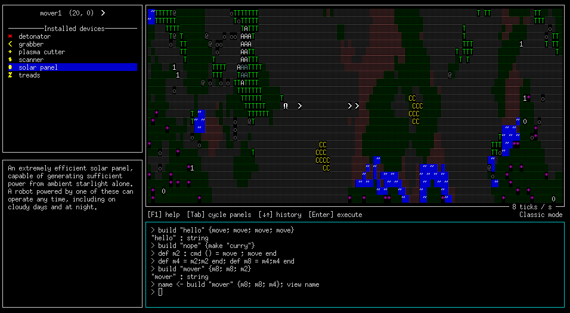

The view is now centered on `mover1` instead of on our `base`, and the
top-left panel shows `mover1`'s inventory and installed devices
instead of `base`'s.  (However, commands entered at the REPL will
still be executed by `base`.)  To return to viewing `base` and its
inventory, you can type `view "base"` at the prompt, or focus the
world panel (either using `Tab` or `Meta-w`) and hit `c`.

Exploring
---------

So what is all this stuff everywhere?  Let's find out!  When you
`build` a robot, by default it starts out with a `scanner` device,
which you may have noticed in `mover1`'s inventory.  You can `scan`
items in the world to learn about them, and later `upload` what you
have learned to the base.

Let's build a robot to learn about those green `T` things to the west:
```
build "s" {turn west; m4; move; scan west; turn back; m4; upload "base"; selfdestruct}
```
The `turn` command causes a robot to turn, of course. It takes a
direction as an argument, which can be either an absolute direction
(`north`, `south`, `east`, or `west`) or a relative direction
(`forward`, `back`, `left`, `right`, or `down`).

Notice that the robot did not actually need to walk on top of a `T` to
learn about it, since it could `scan west` to scan the cell one unit
to the west (you can also `scan down` to scan an item directly underneath the
robot).  Also, it was able to `upload` at a distance of one cell away from
the base.

After this robot finishes, the UI should look like this:

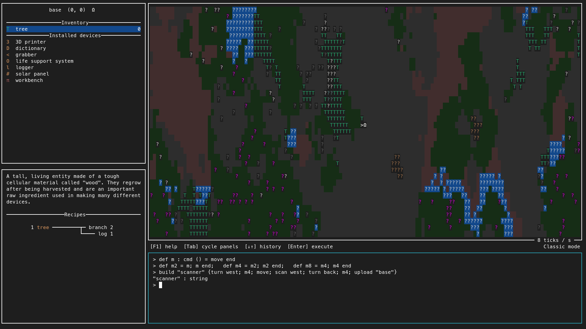

Apparently those things are trees!  Although you do not actually have
any trees yet, you can tab over to your inventory to read about them.
In the bottom left corner you will see a description of trees along
with some *recipes* involving trees.  There is only one recipe,
showing that we can use a tree to construct two branches and a log.

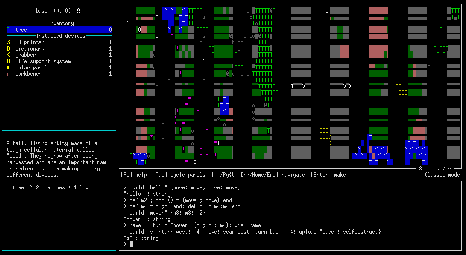

Getting some resources
----------------------

So those tree things look like they might be useful.  Let's get one!
```
build "fetch" {turn west; m8; thing <- grab; turn back; m8; give "base" thing; selfdestruct}
```
You can see that the
`grab` command returns the name of the thing it grabbed, which is
especially helpful when grabbing something unknown. (In this case we
also could have just written `...; grab; ...; give "base" "tree"; ...`.)

You should see a robot head west from your base, grab a tree, and
return to the base.  If all works properly, after the newly built
robot executes the `give` command, the number next to the `tree` entry
in your inventory should turn from 0 to 1.  Note that in this case, we
could have skipped the `scan` step and simply made a robot to go
`grab` a tree and bring it to us; we would find out what it is when we
actually got one in our inventory.  But `scan` is still useful for
things that can't be picked up; you can also make a robot that `scan`s
multiple things before `upload`ing its knowledge to the base.

Since your base has a `workbench` installed, you can use the `make`
command to make things.  Just give it the name of a thing you'd like
to make, and the system will automatically pick a recipe which
produces the thing you requested and for which you have all the
necessary inputs.  In this case we can request to make either a
`"log"` or a `"branch"`; it doesn't matter which, and we will get the
same result either way.

Note that since the `make` command takes a `string` as an argument,
`"log"` has to go in double quotes (otherwise it would be a variable).
You should now have two branches and a log in your inventory.  Take a
look at them and see what recipes they enable!

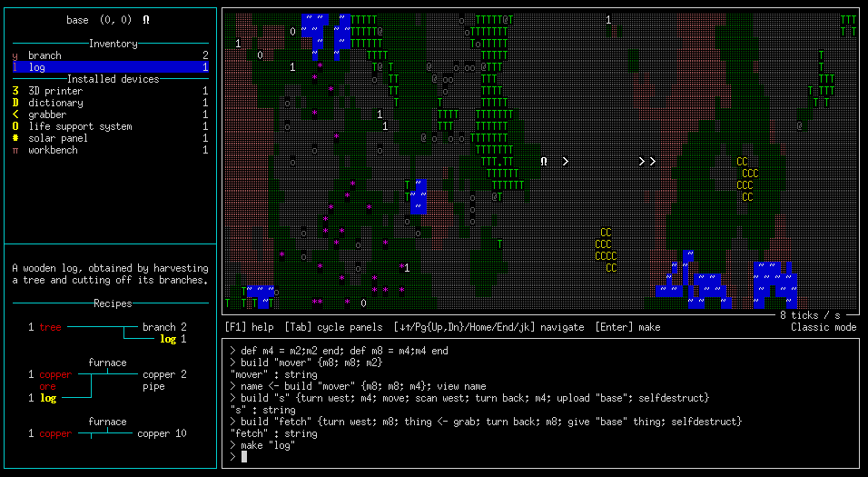

By this time you may also notice that the tree has grown back (whether
it has finished growing back depends on how long you took to read the
intervening tutorial, and on the random number generator).  Some items
in the world will regrow after they have been harvested, and some will
not.

Debugging and cleaning up
-------------------------

You may have noticed that robots which finish running their programs
just sit there forever if they didn't self-destruct.  Relatedly,
various conditions can cause a robot to crash, which would also leave
it stranded.  Let's see both how to clean up leftover robots, and a
simple way to diagnose when something goes wrong.

When a robot program crashes, it prints a message to a log which can
later be used to help diagnose the error---that is, *if* the robot has
a `logger` device.  Otherwise, the error message is simply lost.
Let's `build` a robot with a `logger` device and make it crash on
purpose to see how this works.

First, we have to make a `logger` device.  A `logger` can be made from
one `log`, which you should already have in your inventory, so simply
type `make "logger"` at the REPL.

Now, how de we `build` a robot with the `logger` installed?  The
easiest way is to have the robot explicitly use the `log` command; the
`build` command analyzes the given program and automatically installs
any devices that will be necessary to execute it.  (It is also
possible to manually install devices with the `install` command.)  So
let's type the following:
```
build "crasher" {log "hi!"; turn south; move; grab; move}
```
The world should now look something like the below.  Notice that the
`logger` is gone from your inventory---it was automatically installed
on `crasher`.  Notice also that `crasher` only moved one unit south,
even though we told it to move two steps!  What went wrong?

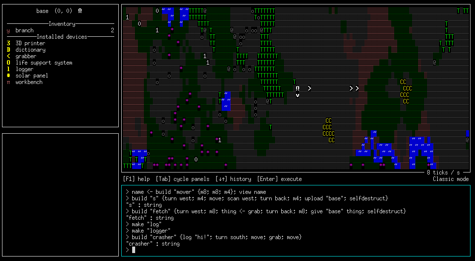

One thing we could do at this point is to `view "crasher"`.  However,
it will probably become a bit more difficult to use the `view` command in
future versions of the game, and in any case, what if we didn't know
or remember the name of the robot that crashed?  Fortunately, there is
something else we can do: send out another robot to `salvage` the
crashed robot.

The `salvage` command can be executed by any robot with a `grabber`,
which is one of the devices installed on new robots by default.  It
takes no arguments, and simply looks for any idle robot in the same
cell; if it finds one, it disassembles the idle robot, transferring
all its inventory and installed devices into the inventory of the
robot that ran the `salvage` command.  It also copies over the log of
the robot being salvaged, appending it to its own log (if it has
one). If there is no idle robot present, the `salvage` command simply
does nothing.

So let's salvage the `crasher` using the code below.  We need
to ensure that the salvaging robot itself has a `logger`, so that it
can copy over the dead robot's log, so we have to first grab another
`tree` in order to make one.   Note the use of
the `upload` command, which we have seen before.  In addition to
uploading knowledge about entities, it turns out that it also uploads
the log from a `logger`.
```
build "fetch" {turn west; m8; thing <- grab; turn back; m8; give "base" thing; selfdestruct}
make "log"
make "logger"
build "salvager" {turn south; move; log "salvaging..."; salvage; turn back; move; upload "base"}
```
The world should now look something like this:

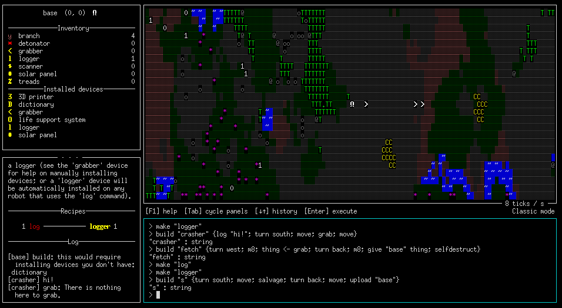

As you can see, the base's log now contains some entries from
`crasher`!  They were copied over to `salvager`'s log when it salvaged
`crasher`, and then to the base's log when `salvager` executed the `upload`
command.  We can see the initial `hi!` entry, and then we can see the
reason that it crashed: it attempted to execute a `grab` instruction
in a cell with nothing to grab.

Loading definitions from a file
-------------------------------

One last thing for now: typing all your definitions at the REPL is
quite tedious, and makes it difficult to go back and edit definitions.
Instead, it is possible to load definitions from a file.  Just type
`run("filename")` and the contents of the file will be executed as if
you typed it at the REPL.  For example, rather than typing definitions
at the prompt, you could put a sequence of definitions in a file,
(note that whitespace is ignored, so format it however you like).
Then you can easily modify the definitions or add more, and just `run`
the file every time you want to reload the definitions.  Eventually,
there will be a way to both save and load commands, but this is better
than nothing for now.

There is some rudimentary [Language Server-based editor
support](https://github.com/byorgey/swarm/blob/main/docs/EDITORS.md)
giving syntax and error highlighting for `.sw` files; at the moment
Emacs is supported, and VSCode will be added shortly.

World generation
----------------

If you do not like the starting place of the base, there is a way
to start somewhere else. *In a different world!*

```bash
$ swarm --seed $RANDOM
```

You can specify the *world seed* leading to radically different
starting conditions. You can start next to a copper patch, between
lakes or in the middle of a plain. Either way, you have established
your base in the shade of what you assume is a tree and now can send
out robots to explore!

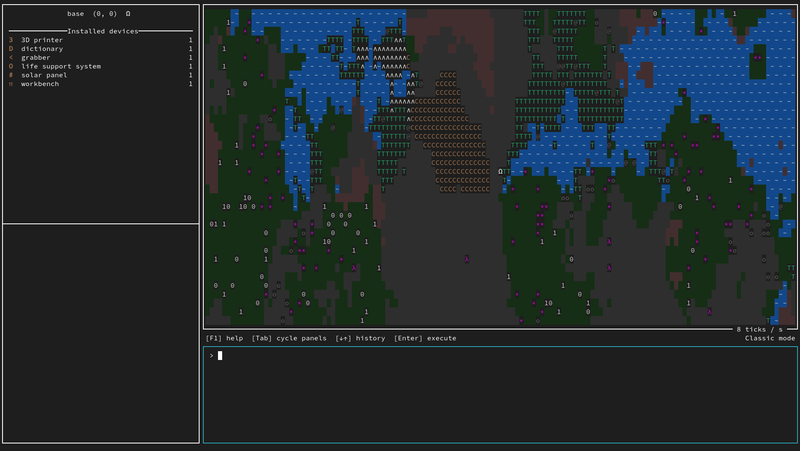

Creative Mode
-------------

For now, there is a secret way to switch between Classic mode and
Creative mode.  In Classic mode, the kinds of actions your robots can
do, and the kinds of programs they can interpret, is restricted by
what devices they have installed.  In Creative mode you can do
anything you like, including fabricate arbitrary items out of thin air
using the `create` command.  To switch, highlight the world view
panel, then hit the `m` key.

Now go forth and build your swarm!
