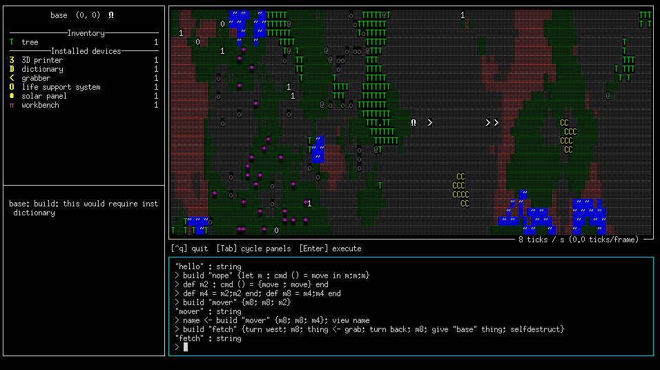

Swarm: The Tutorial
===================

This is a brief tutorial that should hopefully get you up and running
with Swarm.  If you find any mistakes, or things that are confusing,
or ways that the tutorial no longer corresponds to the game, please
[file a bug
report](https://github.com/byorgey/swarm/issues/new/choose) or [open a
pull request](https://github.com/byorgey/swarm/blob/main/CONTRIBUTING.md)!
Eventually, this tutorial file should be [replaced by an in-game
tutorial](https://github.com/byorgey/swarm/issues/25).

The backstory
-------------

In a shockingly original turn of events, you have crash landed on an
alien planet!  ~~Your only hope is to~~ Scratch that, you have no hope
at the moment, but since you're here, you might as well explore a bit.
Your sensors indicate that the atmosphere is highly toxic, so you'll
have to stay inside your robotic base, with its built-in life support
system.  However, you are stocked with all the materials you need to
build a lot of robots to explore for you!  To start, you only have the
materials to make some very basic devices which give your robots
abilities like moving, turning, grabbing things, and interpreting
very simple imperative programs.  As you use your robots to gather
resources, you will be able to construct better devices which in turn
allow you to construct robots with upgraded abilities and programming
language features, which in turn allow you to program more
sophisticated robots which in turn will OK I think you get the idea.

Getting started
---------------

When you first start up Swarm, you should be greeted by a screen that
looks like this:


The little white square in the middle represents your base.  Start by
using the Tab key to cycle through the three panels (the REPL, the
info panel, and the world panel), and read about the various devices
installed on your base.

Building your first robot
-------------------------

Pretty much the only thing you can do is build robots.  Let's build
one!  Tab back to the REPL and type
```
build "hello" {move; move; move; move}
```
then hit Enter.  You should see a robot appear and travel to the
east four steps before stopping.  It should look something like this:


You can also see that on the next line after your input, the REPL printed out
```
"hello" : string
```
which is the result of your command, along with its type.  The `build` command
always returns a string which is the name of the robot that was built;
it may be different than the name you specified if there is already
another robot with that name.

Note that if you don't want a robot to hang around after completing
its job, you can add the `selfdestruct` command to the end of its
program.  Try building a robot that moves a few steps and then
self-destructs.

You can see that a semicolon is used to chain together commands, that
is, if `c1` and `c2` are both commands, then `c1 ; c2` is the command
which executes first `c1` and then `c2`.  The curly braces look fancy
but really they are the same as parentheses (parentheses would work
here too). Ultimately, the `build` command is just a function that takes two
arguments: a string, and a command. (Quiz: if we left out the curly
braces around the sequence of `move` commands, as in `build "hello"
move;move;move;move`, what do you think would happen?  Hint: function
application has higher precedence than semicolon.  Try it and see!)

We can actually see the type of the `build` command by just typing
`build` by itself at the prompt.  It should return something like
```
build : forall a0. string -> cmd a0 -> cmd string
```
which says that `build` takes two arguments---a `string`, and a command
that returns a value of any type---and results in a command which
returns a `string`.  Every command returns a value, though some might
return a value of the unit type, written `()`.

Something you can't do yet
--------------------------

Try entering the following at the REPL:
```
build "nope" {let m : cmd () = move in m;m;m}
```
You should get an error saying something like
```
base: build: this would require installing devices you don't have:
  dictionary
```
This is telling you that in order to `build` a robot which has the right
capabilities to run this program, you would need to
install a `dictionary` device on the robot, but you don't have a
`dictionary` in your inventory.  (You do have a `dictionary` device
*installed* in your base robot, but you can't rip it out and put it in
another robot.  You'll have to find a way to make more.)

Creating definitions
--------------------

We can already tell it's going to be tedious typing
`move;move;move;move;...`.  Since your base has a `dictionary`
installed, let's create some definitions to make
our life a bit easier.  To start, type the following:
```
def m2 : cmd () = {move ; move} end
```

The `: cmd ()` annotation on `m2` is optional; in this situation the
game could have easily figured out the type of `m2` if we had just
written `def m2 = ...` (though there are some situations where a type
signature may be required).  The curly braces are actually optional as
well.  The `end` is required, and is needed to disambiguate where the
end of the definition is.  It may not seem very ambiguous in this
situation, but is needed especially when several definitions are
written in sequence (such as in a file full of definitions).

Now try this:
```
def m4 = m2;m2 end; def m8 = m4;m4 end
```

Great, now we have commands that will execute `move` four and eight
times, respectively.  Finally, let's use them:
```
build "mover" {m8; m8; m2}
```
This should build a robot that moves eighteen steps to the east.

(You might wonder at this point if it is possible to create a function
that takes a number as input and moves that many steps forward.  It
certainly is possible, but right now your robots would not be capable
of executing it.  You'll have to figure out how to upgrade them!)

Getting the result of a command
-------------------------------

The result of a command can be assigned to a variable using a left
arrow, like so:
```
var <- command; ... more commands that can refer to var ...
```
(Yes, this is just like Haskell's `do`-notation; and yes, `cmd` is a
monad, similar to the `IO` monad in Haskell.)  Let's build one more
robot called `"mover"`. It will get renamed to something else to avoid
a name conflict, but we can capture its name in a variable using the
above syntax.  Then we can use the `view` command to focus on it
instead of the base.  Like so:
```
name <- build "mover" {m8; m8; m4}; view name
```
Note that `base` executes the `view name` command as soon as it
finishes executing the `build` command, which is about the same time
as the newly built robot *starts* executing its program.  So we get to
watch the new robot as it goes about its business.  Afterwards, the
view should look something like this:


The view is now centered on `mover1` instead of on our `base`, and the
info panel on the left shows `mover1`'s inventory and installed
devices instead of `base`'s.  (However, commands entered at the REPL
will still be executed by `base`.)  To return to viewing `base` and
its inventory, you can type `view "base"` at the prompt, or tab to
highlight the world view and hit `c`.

Getting some resources
----------------------

We're going to need some resources.  Let's start by getting a tree!
Enter the following:
```
build "fetch" {turn west; m8; grab; turn back; m8; give "base" "tree"; selfdestruct}
```
The `turn` command causes a robot to turn, of course. It takes a
direction as an argument, which can be either an absolute direction
(`north`, `south`, `east`, or `west`) or a relative direction
(`forward`, `back`, `left`, or `right`).

You should see a robot head west from your base, grab a tree, and
return to the base.  If all works properly, after the newly built
robot executes the `give` command, you should see a tree show up in
your inventory, like this:



Tab over to your inventory and take a look at the tree.  In the bottom
left corner you will see a description of the tree along with some
*recipes* involving trees.  Apparently, we can use a tree to construct
a rangefinder (this is just for testing and will go away at some
point!), or two branches and a log.  Let's use the second recipe.
Since your base has a `workbench` installed, you can use the `make` command to
make things.  Just give it the name of a thing you'd like to make, and
the system will automatically pick a recipe which produces the
thing you requested and for which you have all the necessary inputs.
In this case we can request to make either a `"log"` or a `"branch"`; it
doesn't matter which, and we will get the same result either way.


Note that since the `make` command takes a `string` as an argument,
`"log"` has to go in double quotes (otherwise it would be a variable).
You should now have two branches and a log in your inventory.  Take a
look at them and see what recipes they enable!

By this time you may also notice that the tree has grown back!  Some
items in the world will regrow after they have been harvested, and
some will not.

Loading definitions from a file
-------------------------------

One last thing for now: it is possible to load definitions from a
file.  Just type `run("filename")` and the contents of the file will
be executed as if you typed it at the REPL.  For example, rather than
typing definitions at the prompt, you could put a sequence of
definitions in a file, separated by semicolons (note that whitespace
is ignored, so format it however you like).  Then you can easily
modify the definitions or add more, and just `run` the file every time
you want to reload the definitions.  Eventually, there will be a way
to both save and load commands, but this is better than nothing for
now.

Now go forth and build your swarm!

Creative Mode
-------------

For now, there is a secret way to switch between Classic mode and
Creative mode.  In Classic mode, the kinds of actions your robots can
do, and the kinds of programs they can interpret, is restricted by
what devices they have installed.  In Creative mode you can do
anything you like, including fabricate arbitrary items out of thin air
using the `create` command.  To switch, highlight the world view
panel, then hit the `m` key.
