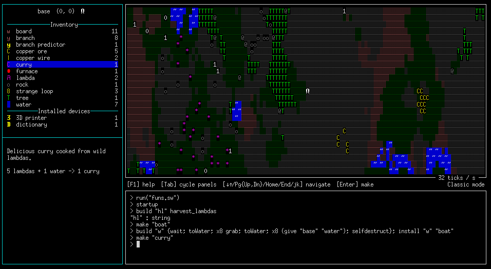

    [BLOpts]
    profile = wp
    postid = 2415
    publish = true
    tags = Swarm, game, robot, programming, resource
    categories = Haskell, projects

It's been about a week since I put out [an announcement and call for
collaboration](https://byorgey.wordpress.com/2021/09/23/swarm-preview-and-call-for-collaboration/)
on a new game, [Swarm](https://github.com/swarm-game/swarm).  Since then,
the response has been fantastic: lots of people have tried it out, a
few have even streamed themselves playing it on Twitch, and there has
been lots of development activity.

- 39 new [issues opened](https://github.com/swarm-game/swarm/issues)
- 27 [pull requests merged](https://github.com/swarm-game/swarm/pulls?q=is%3Apr+is%3Aclosed)
- Lots of great discussion on GitHub issues as well as on IRC

There's still a long, long way to go before the game comes anywhere
close to the vision for it, but we've made great progress!  Some
notable new features added since the initial announcement include:

- New `scan`, `upload`, and `install` commands
- Semicolons are no longer required beetween consecutive `def`s
- Basic help panel, and panel shortcut keys
- Dramatically reduced CPU usage when idle
- An overhaul of parsing and pretty-printing of constants (makes
  adding new constants easier, and an important prerequisite for
  saving definitions and games)
- Better handling of water (you can make curry now)!

  

A couple more exciting things in progress that should land very soon:

- ASCII art recipes

  

- Basic editor integration via LSP, so you can write Swarm programs in
  your favorite editor with automatically highlighted syntax and type
  errors.

And of course there are many other exciting things planned or in the
works.  [Come join us](https://github.com/swarm-game/swarm/)!
