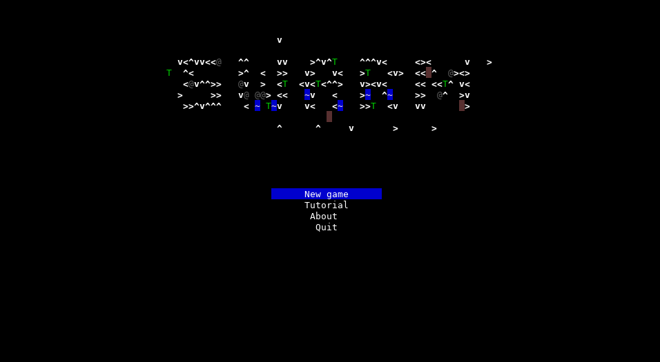
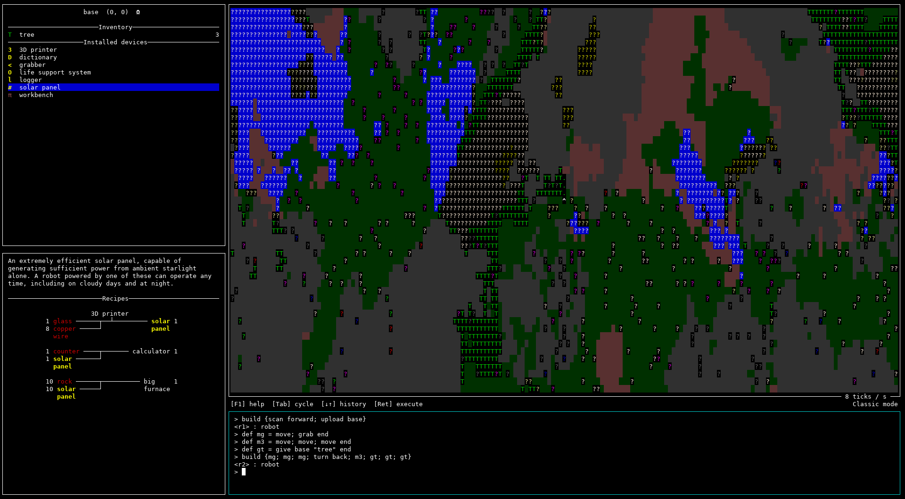

    [BLOpts]
    profile = wp
    postid = 2449
    tags = Swarm, game, robot, programming, resource
    categories = Haskell, projects

[Swarm](https://github.com/swarm-game/swarm/) is a 2D programming and resource gathering game, written in Haskell.  I [announced it last September](https://byorgey.wordpress.com/2021/09/23/swarm-preview-and-call-for-collaboration/) and [gave an update one week after that](https://byorgey.wordpress.com/2021/10/01/swarm-a-lot-can-happen-in-a-week/), but haven't written anything since then.  However, that doesn't mean development has stopped!  Since last October, the repo has grown by an additional 4K lines of Haskell code (to 12K).  Notable changes since then include:

- Many UI improvements, like a main menu, ASCII art recipes, and mouse support
- Many new entities and recipes (multiple types of motors, drills, and mines; new materials like iron, silver, quartz, and glass; new devices like circuits, clocks, cameras, comparators, compasses, ...)
- The game now supports *scenarios*, generically describing how to initialize the game and what the winning conditions should be: scenarios can be used to describe open-world games, tutorials, tricky programming challenges, ... *etc.*
- Improvements to the programming language, like a new dedicated `robot` type, and a "delay" type for things that should be evaluated lazily
- Increased emphasis on exploration, with the ability to `scan` unknown entities in the world

Development has picked up considerably in the past few weeks, and we're making good progress toward a planned [alpha release](https://github.com/orgs/swarm-game/projects/1/views/5) (though no concrete plans in terms of a release date yet).  If you're interested in getting involved, check out our [contribution guide](https://github.com/swarm-game/swarm/blob/main/CONTRIBUTING.md), come join us on IRC (`#swarm` on Libera.Chat) and take a look at the list of [issues marked "low-hanging fruit"](https://github.com/swarm-game/swarm/issues?q=is%3Aissue+is%3Aopen+label%3A%22C-Low+Hanging+Fruit%22)---as of this writing there are 28 such issues, so plenty of tasks for everyone!
