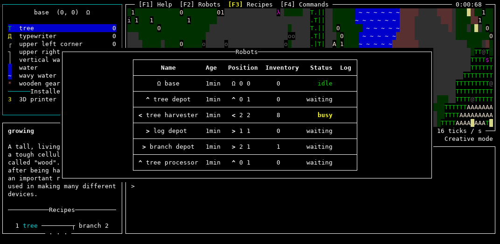

    [BLOpts]
    profile = wp
    tags = Swarm, game, robot, programming, resource
    categories = Haskell, projects

The [Swarm](https://github.com/swarm-game/swarm/) development team is
very proud to announce an alpha release of the game.  There are still
many missing features (for example, [saving games is not yet
possible](https://github.com/swarm-game/swarm/issues/50)) and [known
bugs](https://github.com/swarm-game/swarm/issues?q=is%3Aissue+is%3Aopen+label%3ABug+),
but at this point it's quite playable (and, dare we say, fun!) and
ready for some intrepid souls to try it out and give us some feedback.

As a reminder, Swarm is a 2D programming and resource gathering game,
written in Haskell. Notable changes since the [last progress
update](https://byorgey.wordpress.com/2022/06/20/swarm-status-report/) include:

- An all-new in-game tutorial consisting of a sequence of guided challenges
- Several new challenge scenarios, and documentation on making your own
- Lots more in-game help and info, including help on currently available
  commands + recipes, and a modal showing all live robots
- Many more entities, recipes, and language features to explore and collect
- Better mouse support
- Backwards incremental search and tab completion in the REPL
- Many, many small bug fixes and improvements!

To install, check out the [installation
instructions](https://github.com/swarm-game/swarm#installing): you can
download a [binary release](XXX) for your platform, or [install from
Hackage](https://hackage.haskell.org/package/swarm).  Give it a try
and [send us your feedback](https://github.com/swarm-game/swarm/issues/new/choose)!

If you're interested in getting involved, check out our [contribution
guide](https://github.com/swarm-game/swarm/blob/main/CONTRIBUTING.md),
come join us on IRC (`#swarm` on Libera.Chat), or take a look at the
list of [issues marked "low-hanging
fruit"](https://github.com/swarm-game/swarm/issues?q=is%3Aissue+is%3Aopen+label%3A%22C-Low+Hanging+Fruit%22).

Brought to you by the swarm development team:

Brent Yorgey
Ondřej Šebek
Tristan de Cacqueray

With contributions from:

Alexander Block
Daniel Díaz Carrete
Huw Campbell
Ishan Bhanuka
Jacob
Jens Petersen
José Rafael Vieira
Joshua Price
lsmor
Noah Yorgey
Norbert Dzikowski
Paul Brauner
Ryan Yates
Sam Tay

...not to mention many others who gave valuable suggestions and
feedback.  Want to see your name listed here in the next release?
[See how you can
contribute!](https://github.com/swarm-game/swarm/blob/main/CONTRIBUTING.md)
