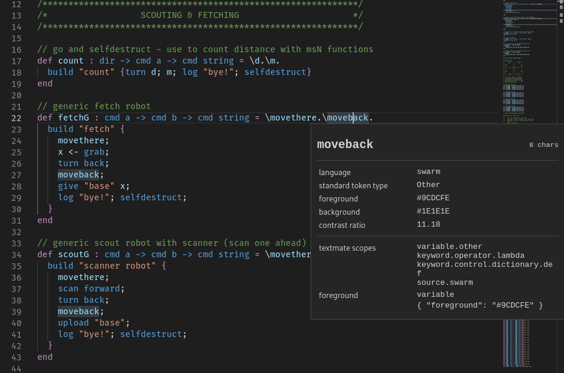

# swarm-language README

This VSCode extension provides a basic highlighting and LSP client for the swarm programming language.

## Extension Settings

There are no customizations yet, sorry.

## Known Issues

Calling out known issues can help limit users opening duplicate issues against your extension.
